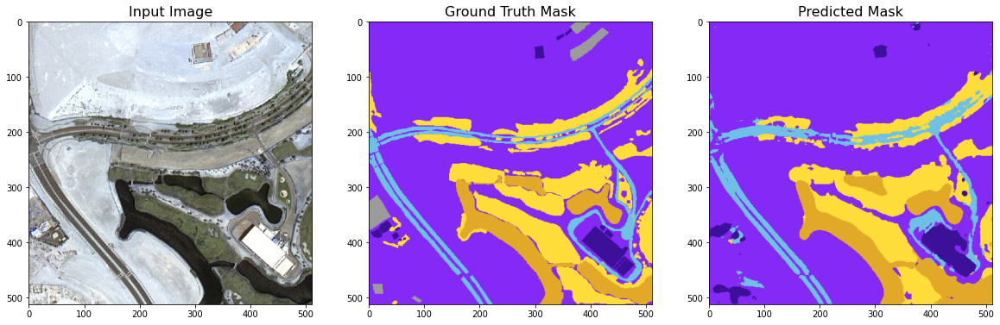

Project description
Segment 6 classes:
• Building
• Land
• Road
• Vegetation
• Water
• Unlabeled
I used a lot of augmentation. the data set collected from Kaggle.
I used inception as a backbone for the U-net.
# Project Name

## Example Image

